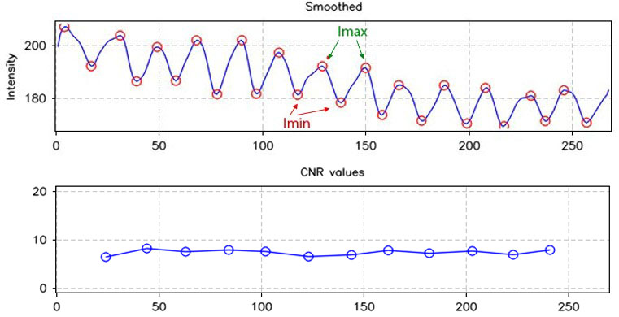

# Image Quality Measurement software for Cylinder Battery

## 1. Introduction

### 1.1. Objective and Requirement

With a same battery sample, in the factory, if they change the setting of Xray machine, the captured image will have different properties and quality levels. We want to find out which image has the best quality in the **viewpoint of computer** (not human vision), it means the information on the image is clearly, distinctively.

Image Quality Measurement software is developed with the aim of providing the objective quality score for Cylinder Battery in the pole region. This software provides 3 quality metrics: Signal to Noise Ratio (SNR), Contrast Transfer Function (CTF), Contrast to Noise Ratio (CNR). These quality scores is relative scores, it means that it can only comparable between image of a same content, not across different contents.

### 1.2. Measurement region

In the pole region, we calculate the quality for the middle of each part only, because the quality of this area can be representative for whole pole region. Then, we take the average result of Middle Left and Middle Right as the quality score of image.

### 1.3. Quality metrics

|Image property changes|SNR|CTF|CNR|
|-|-|-|-|
|Noise Power ↑|↓|No change|↓|
|Contrast ↓|No change|↓|↓|
|Brightness ↑|↑|↓|No change|

#### 1.3.1. Signal to Noise Ratio (SNR)

SNR is defined as the ratio of signal power (cumulative function of measurement region) to its noise power:

**SNR value will increase when image has less noise, or when the brightness is increased.**

#### 1.3.2. Contrast Transfer Function (CTF)

**CTF is increase when contrast of image go up, or brightness of image go down.**

#### 1.3.3. Contrast to Noise Ratio (CNR)

**CNR is increase when image has a better** **contrast, or** **has less noise.**

## 2. Environment setting

- Windows 10 x64
- .NET v4.8

## 3. Usage

- Click "Browser" button to choose image folder, or use button "Open File" to select only serveral images.

**Tips: This software support TIF (grayscale 8/16 bits per pixel), BMP and JPG format**

### 3.1. Measure quality metrics

- After image is loaded, drag and drop the mouse to manually select the pole region. Two measurement parts are highlight as cyan rectangular. Quality scores are displayed on the table and graph of CTF and CNR of each part are shown.

- If user want to adjust the size or move the of selected region, user can click on button "Move".

- User can zoom in/zoom out the image by scrolling the mouse, or rotate the image by right mouse button.

- Click "Previous" or "Next" to change to another images in the same folder.

- Typical values on the table are editable.

- Button "Apply to All" is used to apply the current pole region selection to all images on the same folder.

- Button "Export Result" will write the quality scores result of all images in the folder to text file.

**Tips: For quality of Cylinder Battery typical value, please use one of these two values:**

**Tips: To be fair when compairing images quality in a test, please choose the same ROI height for all testing images.**

### 3.2. Tone Mapping 16-bit images into 8-bit images

- After user load the a 16-bit image file, then drag and drop the mouse to manually select the pole region. The image on the screen will show the tone mapped image which optimized for the pole region.

- Button "Export TMO" will be used for writing the tonemapped image into disk (in .BMP format in the same location as original 16-bit image).